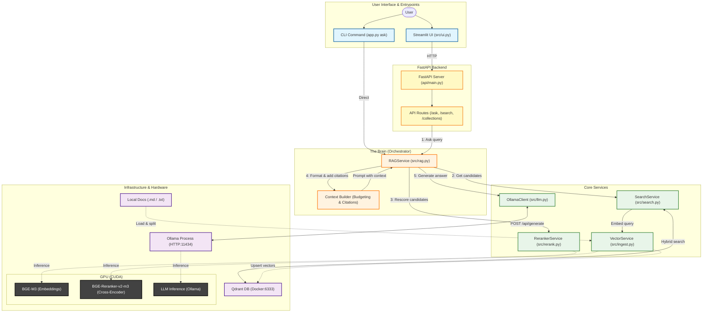

# CiteRAG

[](https://github.com/jpcunhadias/citerag/actions/workflows/ci.yml)

CiteRAG is a self-hosted question-answering system for technical documentation. It indexes local `.md`/`.txt` docs, retrieves with hybrid dense+sparse search and cross-encoder reranking, and answers with enforced citations: if the LLM can't back a claim with a source, the answer is replaced with a refusal instead of shown unsupported. All inference runs locally — no data leaves your machine.

## Features

- **Hybrid retrieval** — dense + sparse embeddings (`BAAI/bge-m3`) fused with Reciprocal Rank Fusion, so both semantic and keyword matches surface.
- **Cross-encoder reranking** (`BAAI/bge-reranker-v2-m3`) refines the candidate set before it reaches the LLM.
- **Enforced citations** — answers are checked for citation labels before being returned; an uncited answer is replaced with a refusal rather than shown as fact.
- **Optional HyDE retrieval** — retrieve using an LLM-generated hypothetical answer instead of the raw query, useful for short or keyword-poor questions. Only affects retrieval; the final answer is still grounded in the real question.
- **Incremental ingestion** — re-running ingestion skips unchanged files (by content hash) and cleans up chunks left behind by edited files, instead of re-embedding everything every time.
- **Answer-quality eval harness** — a golden set of questions run against the live pipeline, checked against known-good expectations. Catches regressions that a mocked-model unit test suite can't. See [`eval/README.md`](eval/README.md).
- **Three interfaces** — a Streamlit chat UI, a FastAPI backend, and a CLI, all backed by the same `RAGService`.

## Architecture



Two pipelines:

1. **Ingestion** — `CLI → Loader → Cleaner → HeaderSplitter → RecursiveSplitter → VectorService → Qdrant`. Loads `.md`/`.txt` files, cleans and chunks them deterministically, generates dense + sparse embeddings, and indexes into Qdrant.
2. **Search** — `Query → Hybrid Search → Reranking → LLM Synthesis → Answer`. A query triggers hybrid search in Qdrant, results are reranked, and the top results become context for a cited answer.

## Tech Stack

- **Vector DB:** Qdrant (Docker)
- **Backend API:** FastAPI + Uvicorn
- **Frontend:** Streamlit
- **Embedding model:** `BAAI/bge-m3` (via `FlagEmbedding`)
- **Reranker model:** `BAAI/bge-reranker-v2-m3`
- **LLM:** Ollama
- **Core libraries:** `langchain`, `sentence-transformers`, `torch`, `qdrant-client`, `fastapi`, `httpx`
- **Tooling:** `uv`, `ruff`, `mypy`, `pytest`

## Getting Started

### Prerequisites

- [uv](https://docs.astral.sh/uv/) (manages the Python version from `.python-version` and all dependencies)
- Docker and Docker Compose
- [Ollama](https://ollama.com/) installed and running

### Installation & Setup

1.  **Clone the repository:**
    ```bash
    git clone git@github.com:jpcunhadias/citerag.git
    cd citerag
    ```

2.  **Install Python dependencies:**
    ```bash
    uv sync
    ```
    Creates `.venv`, installs the pinned Python version if needed, and installs all dependencies (including dev tools) from `uv.lock`. Prefix commands below with `uv run` (e.g. `uv run pytest`), or `source .venv/bin/activate` once per shell.

3.  **Pull an LLM model:**
    ```bash
    ollama pull llama3
    ```
    Matches the default `OLLAMA_MODEL_NAME`; set that env var to use a different model.

4.  **Start services with Docker Compose:**

    **Option A: Full stack**
    ```bash
    docker-compose up -d
    ```
    Starts Qdrant, the FastAPI backend, and the Streamlit UI:
    - Streamlit UI: http://localhost:8501
    - FastAPI API: http://localhost:8000
    - API docs: http://localhost:8000/docs

    **Option B: Qdrant only** (run FastAPI/Streamlit locally — see [Usage](#usage))
    ```bash
    docker-compose up -d qdrant
    ```

    **Notes:**
    - Models are kept on the host filesystem (`~/.cache`) and mounted into containers to avoid re-downloading.
    - Ollama must listen on all interfaces for containers to reach it: `export OLLAMA_HOST=0.0.0.0:11434` before `ollama serve` (or add to your shell profile).
    - `HOME` must be set for model cache mounting to work.
    - Rebuild after code changes: `docker-compose build && docker-compose up -d`.

## Usage

### Ingesting documents (CLI)

```bash
python3 app.py ingest --input <path_to_your_docs> --collection <your_collection_name>
```

- `--input`: directory of `.md`/`.txt` files
- `--collection`: Qdrant collection name
- `--library`, `--version`: optional metadata tags
- `--prune-missing`: also delete chunks for files no longer under `--input` (off by default — only safe if this collection is populated exclusively from this `--input` directory; see the flag's `--help` text)

```bash
# Ingest documentation for the pandas library
python3 app.py ingest \
  --input data/raw/pandas-docs \
  --collection pandas_v2 \
  --library pandas
```

Ingestion is incremental: unchanged files are skipped by content hash, and stale chunks from edited files are cleaned up automatically.

### Asking questions (Web UI)

```bash
docker-compose up -d
```
Open http://localhost:8501.

**Local development**, instead of Docker:
```bash
uvicorn api.main:app --reload      # terminal 1
streamlit run ui.py                 # terminal 2
```
Select a collection in the sidebar and start asking questions. The Streamlit UI needs the FastAPI backend running; the CLI does not.

### Asking questions (CLI)

```bash
python3 app.py ask "<your_question>" --collection <your_collection_name>
```

```bash
python3 app.py ask "how do i merge two dataframes?" --collection pandas_v2
```

Outputs the answer plus the sources used. Add `--hyde` to retrieve using an LLM-generated hypothetical answer instead of the raw query ([HyDE](https://arxiv.org/abs/2212.10496)) — see [`eval/README.md`](eval/README.md) to A/B it against the baseline.

## Configuration

### CORS

The API restricts cross-origin requests via the `CORS_ORIGINS` environment variable.

```bash
# Development default
CORS_ORIGINS=http://localhost:8501

# Production: comma-separated origins
CORS_ORIGINS=https://your-app.example.com,https://admin.example.com
```

Set it in `docker-compose.yml` under the `api` service, or when running `uvicorn` directly. Never use a wildcard (`*`) origin in production.

## Development

### Code quality

```bash
uv run pre-commit install          # one-time: install git hooks

uv run ruff format .               # format
uv run ruff format --check .       # check formatting
uv run ruff check .                # lint
uv run ruff check --fix .          # auto-fix lint issues
uv run mypy src api                # type-check
```

Pre-commit runs ruff (format + lint) and basic file hygiene checks on every commit. Bypass with `git commit --no-verify` if you must, but CI runs the same checks.

### Tests

```bash
uv run pytest tests/unit/ -v          # fast, no external services
uv run pytest tests/integration/ -v   # requires Qdrant, Ollama, FastAPI running
uv run pytest tests/ -v               # both
```

`tests/integration/test_docker_setup_integration.py [collection_name]` smoke-tests a running Docker Compose deployment (health, collections, search, ask, Streamlit reachability).

### Evaluating answer quality

Unit and integration tests mock the models out — they verify the code runs, not that answers are good. `eval/` runs a fixed set of questions through the live pipeline and checks answers against known-good expectations (keywords, citation counts, expected refusals). Requires a live stack, so it doesn't run in CI. See [`eval/README.md`](eval/README.md).
