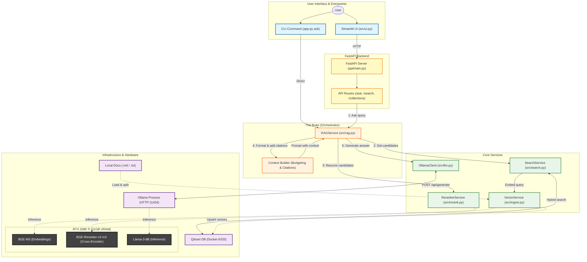

# RAG DS DocSearcher

A self-hosted, offline-first documentation search engine powered by a Retrieval-Augmented Generation (RAG) pipeline. This system indexes local technical documentation and provides a simple web interface for asking questions and finding relevant information.

## High-Level Architecture



## Features

- **Offline-First:** Runs entirely on local hardware. No data leaves your machine.
- **State-of-the-Art RAG:** Implements a sophisticated RAG pipeline using cutting-edge models.
- **Hybrid Search:** Utilizes `BGE-M3` for dense and sparse embeddings, ensuring both semantic and keyword understanding.
- **Cross-Encoder Re-ranking:** Employs `BGE-Reranker-v2-M3` to refine search results for maximum relevance.
- **LLM Synthesis:** Uses `Llama-3-8B` via Ollama to generate accurate, context-aware answers.
- **Dual Interfaces:** Interact via a clean Streamlit web UI or a powerful command-line interface.
- **Citation-Aware:** All generated answers include citations, allowing you to verify the source of the information.

## Tech Stack

- **Vector DB:** Qdrant (running in Docker)
- **Backend API:** FastAPI with Uvicorn
- **Frontend:** Streamlit
- **Embedding Model:** `BAAI/bge-m3` (via `FlagEmbedding`)
- **Reranker Model:** `BAAI/bge-reranker-v2-m3`
- **LLM:** Ollama with `Llama-3-8B-Instruct`
- **Core Libraries:** `langchain`, `sentence-transformers`, `torch`, `qdrant-client`, `fastapi`, `httpx`

## Architecture

The system is composed of two main pipelines:

1.  **Ingestion Pipeline:**
    `CLI -> Loader -> Cleaner -> HeaderSplitter -> RecursiveSplitter -> VectorService -> Qdrant`
    This pipeline loads `.md` and `.txt` files, cleans the text, splits it into deterministic chunks, generates dense and sparse embeddings, and indexes them into the Qdrant vector database.

2.  **Search Pipeline:**
    `Query -> Hybrid Search -> Re-ranking -> LLM Synthesis -> Answer`
    A user query triggers a hybrid search in Qdrant. The results are re-ranked for relevance, and the top results are used as context for the LLM to generate a final, cited answer.

## Getting Started

### Prerequisites

- [uv](https://docs.astral.sh/uv/) (manages the Python version from `.python-version` and all dependencies)
- Docker and Docker Compose
- [Ollama](https://ollama.com/) installed and running.

### Installation & Setup

1.  **Clone the repository:**
    ```bash
    git clone git@github.com:jpcunhadias/rag-ds-docsearcher.git
    cd rag-ds-docsearcher
    ```

2.  **Install Python dependencies:**
    ```bash
    uv sync
    ```
    This creates `.venv`, installs the pinned Python version if needed, and installs all dependencies (including dev tools) from `uv.lock`. Prefix any command below with `uv run` (e.g. `uv run pytest`), or `source .venv/bin/activate` once per shell.

3.  **Pull the required LLM model:**
    ```bash
    ollama pull llama3:8b-instruct
    ```

4.  **Start services with Docker Compose:**

    **Option A: Full stack (recommended for production)**
    ```bash
    docker-compose up -d
    ```
    This starts Qdrant, FastAPI backend, and Streamlit UI. Access:
    - Streamlit UI: http://localhost:8501 (or http://<your-ip>:8501 from other devices on your network)
    - FastAPI API: http://localhost:8000 (or http://<your-ip>:8000 from other devices on your network)
    - API Docs: http://localhost:8000/docs (or http://<your-ip>:8000/docs from other devices on your network)

    **Option B: Qdrant only (for local development)**
    ```bash
    docker-compose up -d qdrant
    ```
    Then run FastAPI and Streamlit locally (see Usage section below).

    **Important Notes:**
    - Models are kept on the host filesystem (`~/.cache`) and mounted into containers to avoid re-downloading
    - **Ollama Configuration**: Ollama must be configured to listen on all interfaces (not just localhost) for containers to access it:
      ```bash
      # Set OLLAMA_HOST environment variable before starting Ollama
      export OLLAMA_HOST=0.0.0.0:11434
      ollama serve
      ```
      Or add to your shell profile: `echo 'export OLLAMA_HOST=0.0.0.0:11434' >> ~/.bashrc`
    - The `HOME` environment variable must be set for model cache mounting to work
    - To rebuild containers after code changes: `docker-compose build && docker-compose up -d`

## Production Configuration

### CORS Security

The FastAPI backend uses CORS (Cross-Origin Resource Sharing) middleware to control which origins can make requests to the API. This is critical for production security.

**Default Configuration (Development):**
```bash
CORS_ORIGINS=http://localhost:8501
```

**Production Configuration:**
Set the `CORS_ORIGINS` environment variable to your specific frontend URL(s):
```bash
CORS_ORIGINS=https://your-app.example.com,https://admin.example.com
```

**To configure for production:**
1. Edit `docker-compose.yml` and update the `CORS_ORIGINS` environment variable under the `api` service
2. Or set the environment variable when starting the API:
   ```bash
   export CORS_ORIGINS=https://your-app.example.com
   uvicorn api.main:app --host 0.0.0.0 --port 8000
   ```

**Security Warning:** Never use wildcard origins (`*`) in production as this allows any website to make requests to your API, creating a significant security vulnerability.

## Usage

This project provides two interfaces: a web app and a CLI.

### 1. Ingesting Documents (CLI)

Before you can search, you must index your documentation.

1.  Place your `.md` or `.txt` files in a directory (e.g., `data/raw/my-docs`).
2.  Run the ingestion command:
    ```bash
    python3 app.py ingest --input <path_to_your_docs> --collection <your_collection_name>
    ```
    - `--input`: Path to the directory containing your documents.
    - `--collection`: A unique name for the Qdrant collection.
    - `--library`, `--version`: (Optional) Metadata tags.

    **Example:**
    ```bash
    # Ingest documentation for the pandas library
    python3 app.py ingest \
      --input data/raw/pandas-docs \
      --collection pandas_v2 \
      --library pandas
    ```

### 2. Asking Questions (Web UI)

The easiest way to interact with your documents is through the Streamlit web application.

**Using Docker Compose (recommended):**
```bash
docker-compose up -d
```
Then open http://localhost:8501 in your browser.

**Using local development:**
1.  **Start the FastAPI backend:**
    ```bash
    uvicorn api.main:app --reload
    ```
    This will start the API server at `http://localhost:8000`. The `--reload` flag enables hot-reload during development.

2.  **Start the Streamlit UI** (in a separate terminal):
    ```bash
    streamlit run ui.py
    ```
3.  **Open your browser** to the displayed URL (usually `http://localhost:8501`).
4.  **Select your collection** from the sidebar and start asking questions.

**Note:** The Streamlit UI requires the FastAPI backend to be running. The CLI (`app.py ask`) works independently and does not require the backend.

### 3. Asking Questions (CLI)

For command-line enthusiasts, the `ask` command provides a direct way to get answers.

```bash
python3 app.py ask "<your_question>" --collection <your_collection_name>
```

**Example:**
```bash
python3 app.py ask "how do i merge two dataframes?" --collection pandas_v2
```

This will output a detailed answer along with the sources used to generate it.

## Development Setup

### Code Quality Tools

This project uses automated code quality checks to maintain consistent code style and catch issues early.

#### Pre-commit Hooks

Pre-commit hooks run automatically before each commit to check formatting and linting. **All developers must set up pre-commit hooks.**

1. **Install dependencies (includes pre-commit):**
   ```bash
   uv sync
   ```

2. **Install the git hooks:**
   ```bash
   uv run pre-commit install
   ```

3. **Test the hooks (optional):**
   ```bash
   uv run pre-commit run --all-files
   ```

Now, when you commit, the hooks will:
- Auto-format and auto-fix lint issues with `ruff`
- Check for trailing whitespace, large files, and other common issues
- Block the commit if unfixable issues are found

**Note:** You can bypass hooks with `git commit --no-verify`, but this is discouraged. All code should pass formatting and linting checks before committing.

#### Manual Code Quality Checks

You can also run checks manually:

```bash
# Format code
uv run ruff format src tests api scripts

# Check formatting (without modifying files)
uv run ruff format --check src tests api scripts

# Lint code
uv run ruff check src tests api scripts

# Auto-fix linting issues
uv run ruff check --fix src tests api scripts

# Type-check
uv run mypy src api
```

#### Running Tests Locally

Before pushing code, run tests locally:

```bash
# Run fast unit tests (no external services needed)
uv run pytest tests/unit/ -v

# Run integration tests (requires Qdrant, Ollama, FastAPI)
uv run pytest tests/integration/ -v

# Run all tests
uv run pytest tests/ -v
```

**Important:** Ensure all tests pass locally before creating a pull request.

## Testing

Run the automated test script to validate your setup:

```bash
python3 tests/integration/test_docker_setup_integration.py [collection_name]
```

This will test:
- API health endpoint
- Collections endpoint
- Search endpoint (if collection provided)
- Ask/RAG endpoint (if collection provided)
- Streamlit UI accessibility

See `tests/integration/test_docker_setup_integration.py` for more details.
